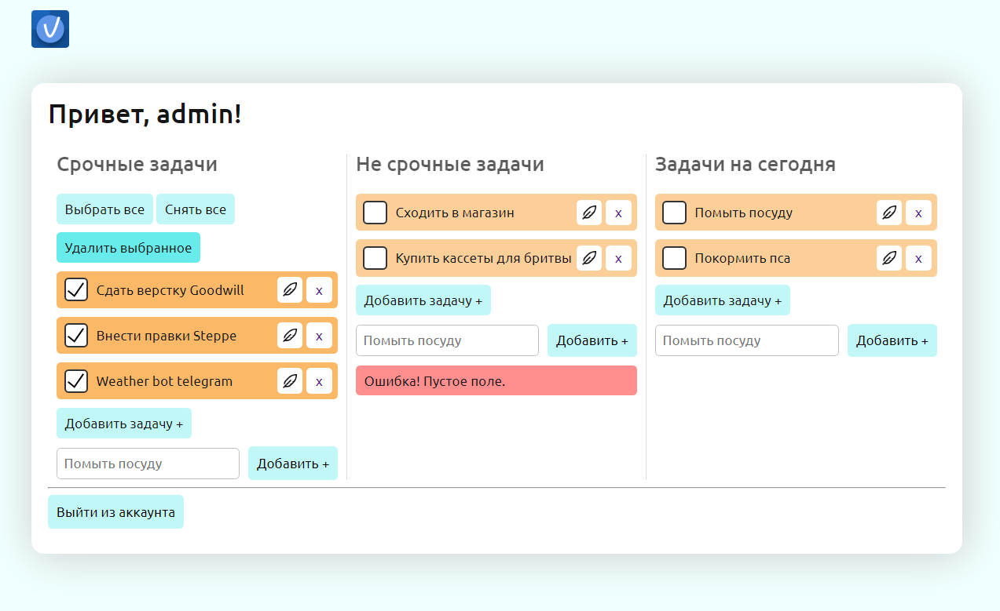

# ✅ Todo List Web App
    

## Description

Simple Todo list with login system and 3 task lists for per user can help you manage your own day and don't let you forgot anything.
Add, remove, edit, delete all tasks in one click and much more!

Used languages and techonlogies:
1. PHP
2. ORM RedBeanPHP
3. Vue.JS
4. Axios API

*The code has NOT been polished and is provided "as is". There are a lot of code that are redundant and there are tons of improvements that can be made.*

## Install & set up
To launch it in your local server, just copy project in your website folder, and change database info in the 
`scripts/includes/config.php` file.\
**Example**: `R::setup('mysql:host=localhost;dbname=phptutor','root','');`

If you wish add one more tasks list your user profile, jump to `index.php` file and duplicate `<todo-list></todo-list>` tag.\
It is a Vue.js component.
After that, fill `list` and `title` required attributes.
`list` it's your *unique* list name, that needs to create new table in database for storing tasks.\
`title` just title of your list that will appear into view.\
**Example**: `<todo-list list="tomorrow" title="Tasks for tomorrow"></todo-list>`

## Credits
[https://redbeanphp.com/index.php](https://redbeanphp.com/index.php "RedBeanPHP")\
[https://vuejs.org/](https://vuejs.org/ "Vue.JS")\
[https://axios-http.com/docs/intro](https://axios-http.com/docs/intro "Axios API")
